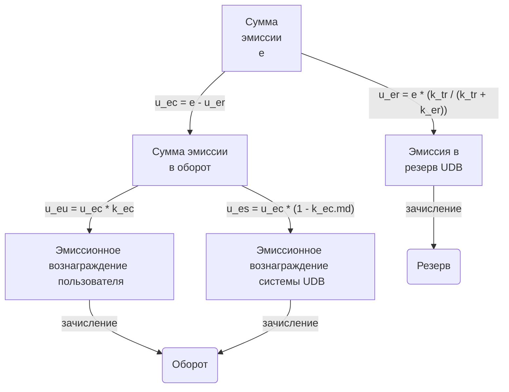

# Эмиссия

1. Эмиссия (`e`) — процедура ввода новых [U](./u.md) в [UDB](./udb.md).
2. Эмиссия осуществляется при регистрации нового [товара](./goods.md) в [UDB](./udb.md).
3. Единица [товара](./goods.md) не должна регистрироваться дважды одновременно; попытка 
повторной регистрации без [Изъятия](./recall.md) считается [Нарушением](./violation.md).
4. Эмиссия обеспечивает рост масс [U](./u.md), гарантированно эквивалетный 
материальной ценности [товара](./goods.md).
5. Эмиссия дает основание для проведения [валидации](./validation.md).
6. Обратным действием для [эмиссии](./emission.md) является [отзыв](./recall.md).


# Виды эмиссии

1. Эмиссия бывает двух видов:
   1. [Стартовая](#стартовая-эмиссия.md) — при невозможности стоимостной оценки 
   товара в [U](./u.md) на основе данных [UDB](./udb.md).
   2. [Рабочая](#рабочая-эмиссия.md) — для товаров, для которых возможна оценка в 
   [U](./u.md).


## Стартовая эмиссия

1. Стартовая эмиссия выполняется при невозможности определения стоимости товара 
в [U](./u.md) основываясь на данных [UDB](./udb.md).
2. Рассчитвается одним из следующих способов:
    1. при нулевой стоимости [UDB](./udb.md) (первый товар.md) эмиссия устанавливается в
    значение 1.0, при этом товар становится эталонной мерой конкретной [UDB](./udb.md).
    0. при стоимости [UDB](./udb.md) отличной от 0, оценка выполняется по формуле
    `e = cost_ext / cost_sde_ext * q * ke` где:
        1. e - объем эмиссии
        0. cost_ext - стоимость товара в эталонной на момент эмиссии внешней
        валюте.
        0. cost_sde_ext - совокупная стоимость [UDB](./udb.md) в эталонной валюте на момент
        эмисси, при этом совокупная стоимость [UDB](./udb.md).
        0. q - [количество товара](./q.md).
        0. ke - [публичный нормировочный коэффициент](./ke.md).
    0. при необходимости на основе экспертной оценки по усмотрению [UDB](./udb.md).


## Рабочая эмисиия

1. Выполняется при возможности определения стоимости товара в [U](./u.md).
2. Формула: `e = cost_u * q * ke`, где:
   - `e` — объём [эмиссии](./emission.md)
   - `cost_u` — стоимость [товара](./goods.md) в [U](./u.md) по данным [UDB](./udb.md)
   - `q` — [количество товара](./q.md)
   - `ke` — [публичный нормировочный коэффициент](./ke.md)


# Распределение эмиссии

1. Эмитированные [U](./u.md) распределяются между:
    1. [Резервом](./reserv.md) [UDB](./udb.md) и пополняют [резерв](./reserv.md), 
    отражается публичном балансе [UDB](./udb.md).
    2. [UDB](./udb.md) как пользователем, для компенсации организационных расходов 
    [UDB](./udb.md).
    3. [Пользователем](./user.md), владелецем [товара](./goods.md), как 
    вознаграждение за регистрацию товара, отражается положительно на балансе 
    [Пользователем](./user.md).


## Коэффициенты распределения эмисии

1. Первоначально определяется [эмиссионный коэффициент резерва](./k_er.md).
2. Вторым шагом определяется [сумма эмиссии в резерв](./u_er.md) [UDB](./udb.md).
3. Третим шагом определяется [сумма эмиссии в оборот](./u_ec.md)
4. Далее [сумма эмиссии в оборот](./u_ec.md) делится между [пользователем](./user.md) 
и [udb](./udb.md) по [коэффициенту вознаграждения](./k_ec.md) на 
[сумму эмиссионного вознаграждения пользователя](u_eu.md) и на 
[сумму эмиссионного вознаграждения системы](u_es.md).
5. При этом выполняется:
```
    e = u_er + u_ec = u_er + u_eu + u_es
```


## Зачисление вознаграждения

1. Зачисление вознаграждения [пользователю](./user.md) осуществляется на указанный
[счет](./count.md) пользователя, после чего пользователь может использовать
полученные [U](./u.md) для расчетов с другими пользователям.


## Диаграмма распределения эмиссии

4. Итоговое распределение `эмисии` отражено на следующей диаграмме:



